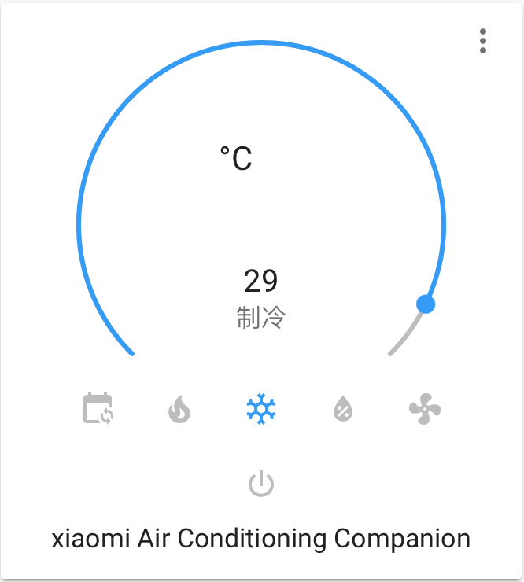

# Xiaomi Air Conditioning Companion 2

This is a custom component for home assistant to integrate the Xiaomi Mi Air Conditioning Companion 2:

| Model ID          | Model number | Product name                            | Shape    |
|-------------------|--------------|-----------------------------------------|----------|
| `lumi.acpartner.mcn02`    | KTBL03LM     | Xiaomi Mi Air Conditioner Companion 2     | square    |

Please follow the instructions on [Retrieving the Access Token](https://www.home-assistant.io/components/vacuum.xiaomi_miio/#retrieving-the-access-token) to get the API token to use in the configuration.yaml file.

Credits: Thanks to [Rytilahti](https://github.com/rytilahti/python-miio) for all the work.

## Features
* Power (on, off)
* Operation Mode (Heat, Cool, Auto, Dehumidify, Ventilate)
* Fan Speed (Low, Medium, High, Auto)
* Swing Mode (On, Off)
* Target Temperature
* Capture and replay infrared commands
* Attributes
  - ac_model
  - ac_power (on, off)
  - load_power (Wh)
  - operation_mode
  - fan_speed
  - swing_mode


## Install

You can install this custom component by adding this repository ([https://github.com/EugeneLiu/xiaomi_airconditioningcompanionMCN02](https://github.com/EugeneLiu/xiaomi_airconditioningcompanionMCN02/)) to [HACS](https://hacs.xyz/) in the settings menu of HACS first. You will find the custom component in the integration menu afterwards, look for 'Xiaomi Air Conditioning Companion 2'. Alternatively, you can install it manually by copying the custom_component folder to your Home Assistant configuration folder.


## Setup

```yaml
# configuration.yaml

climate:
  - platform: xiaomi_miio_airconditioningcompanionmcn02
    name: xiaomi Air Conditioning Companion 2
    host: 
    token: 
    target_sensor: sensor.temperature_158d0001f53706
    scan_interval: 60
```



## Debugging

If the custom component doesn't work out of the box for your device please update your configuration to enable a higher log level:

```yaml
# configuration.yaml

logger:
  default: debug
  logs:
    custom_components.xiaomi_miio_airconditioningcompanionmcn02.climate: debug
    miio: debug
```
